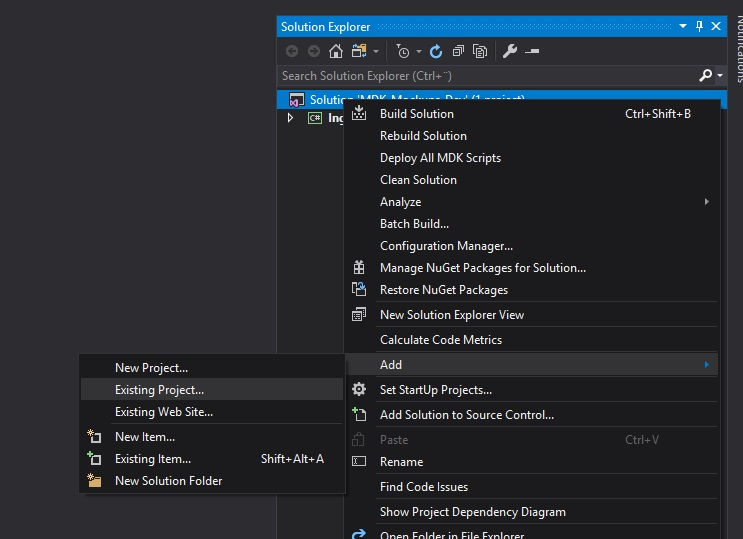
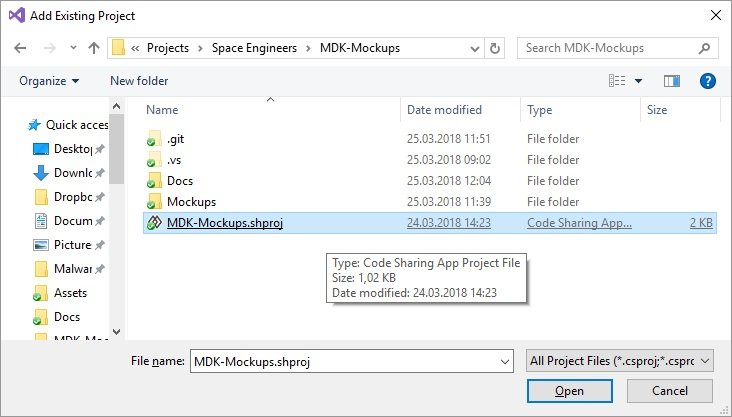
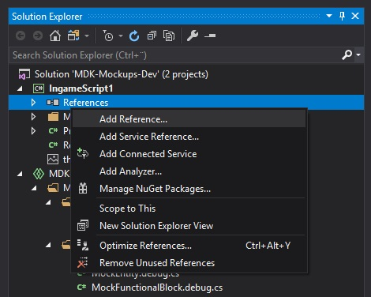
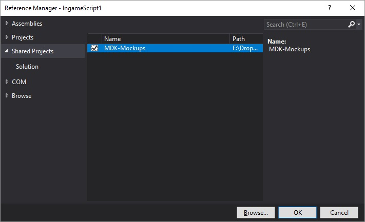

# Getting Started - Use

## Overview

* [Downloading The Repository](#downloading-the-repository)
* [Referencing The Project](#referencing-the-project)
* [An Example Mocked Run](#an-example-mocked-run)


## Downloading The Repository

First you will need to check out the repository using a Git client. You can download the zip file if you wish, but as the entire project is reliant on people updating it it's going to be a lot easier for you to use a Git client so you can update it often.

**It is highly recommended that you download the repository to somewhere close to your MDK script projects**. This is simply to make it easier for you to reference the shared project.

> TODO: Insert Git Tutorial Here


## Referencing The Project

1. Open your script solution. 

2. Right-click on the solution node.

3. Select `Add` -> `Existing Project...`. 
   ​

   

   ​    

4. Select the MDK-Mockups shared project and click `Open`.
   ​

   


   The project is now added to your solution and ready for use.  

   ​

5. Now right-click the `References` node of all the script projects in your solution where you want to add a mocked-up run.
   ​

   

   ​

6. Then select `Shared Project` and check the `MDK-Mockups` project in the list.
   ​

   


   Your projects are now set up to use the mockups.


## An Example Mocked Run

For this example we're going to use a very simple `ConsoleMockedRun`.

The first thing you need to do is edit your `Bootstrapper.cs`, which you will find in your script project's `MDK` folder. Then you need to replace the contents of the `Main` method so it looks like this. Make sure you read the comments.

```csharp
public static void Main()
{
    // Create a run instance, this one is running in the console.
    var run = new ConsoleMockedRun
    {
        // We need a terminal system for the script.
        GridTerminalSystem = new MockGridTerminalSystem
        {
            // This is the programmable block mockup which
            // will pretend to be the running block for our
            // script, the `Me` property
            new MockProgrammableBlock
            {
                // Name it for convenience
                CustomName = "Our PB",

                // Rather than actually instantiating the script
                // we just tell it the type of the script we want
                // it to run
                ProgramType = typeof(Program)
            }

            // We can add more blocks here, separated by a comma.
            // We can even add multiple mocked programmable
            // blocks if we are so inclined.
        }
    };

    // If our script doesn't start itself in its constructor, we'll need
    // to run it manually.
    run.Trigger("Our PB", "An optional argument");

    // If our script doesn't utilize the `Runtime.UpdateFrequency` at all,
    // the following isn't needed. It's not harmful either, though.
    MockedRunFrame frame;
    while (run.NextTick(out frame))
    {
        // Just insert a little delay between ticks. You can change this
        // to your specifications, it's not important.
        Thread.Sleep(16);
    }
}
```


